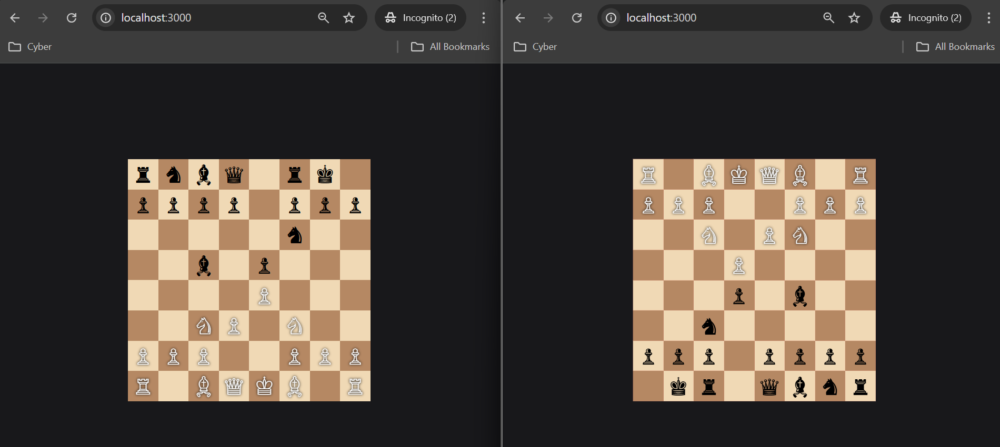
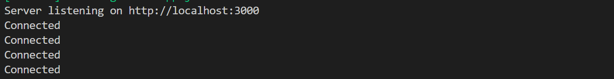

# ChessX – Backend

A backend service for a Chess game built using **Node.js**.  
This project handles core server-side logic such as game management and real-time communication support.

## Tech Stack

- Node.js
- Express.js
- Socket.IO (for real-time gameplay)

## Features

- Multiplayer chess game backend
- Real-time move synchronization
- Game state management
- Scalable server-side architecture

## Demo




## Setup

```bash
npm install
npm run dev
```
